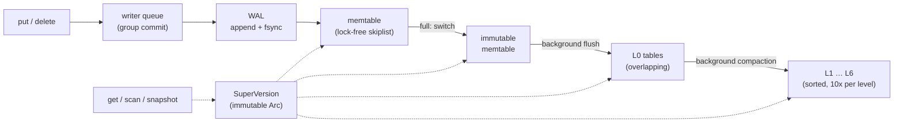

# lsmkv

An LSM-tree key-value storage engine written from scratch in Rust, in the style of LevelDB and RocksDB: a write-ahead log
with group commit, a lock-free skiplist memtable, checksummed SSTables with bloom filters and a block cache,
leveled compaction on a background thread, snapshots, range scans, and crash recovery that has survived
300 rounds of `kill -9`.

About 9,800 lines of Rust (8,100 in `src/`, unit tests included). Three runtime dependencies: `crc32fast`, `crossbeam-skiplist` and `thiserror`.
Every design decision, with the alternatives and the reasoning, is in [DESIGN.md](DESIGN.md) (D1–D24).

```rust,no_run
fn main() -> lsmkv::Result<()> {
    let db = lsmkv::Db::open("data")?;
    db.put(b"user:1", b"alice")?;
    db.put(b"user:2", b"bob")?;
    db.delete(b"user:2")?;

    let snap = db.snapshot(); // a consistent point-in-time view
    db.put(b"user:1", b"carol")?;
    assert_eq!(snap.get(b"user:1")?, Some(b"alice".to_vec()));

    for item in db.scan("user:".."user;")? { // range scan, in key order
        let (key, value) = item?;
        println!("{key:?} = {value:?}");
    }
    Ok(())
}
```

## Architecture



- **Writes** queue up. The writer at the front becomes the *leader*: it appends the whole group to the WAL with one
  write and one fsync, applies it to the memtable, and wakes the others (group commit, D11, D17).
- **A full memtable** becomes immutable, a fresh memtable and WAL take over, and a background thread flushes it to a
  level-0 SSTable. Writes slow down at 8 level-0 tables and stop at 12 (D14–D16).
- **Leveled compaction** merges level n into n+1 on the background thread, streaming one block per input
  (D8, D15, D20). Old versions and tombstones are dropped only when no reader or snapshot can see them (D18).
- **Reads** take no lock beyond copying an `Arc<SuperVersion>`: an immutable bundle of memtables and tables.
  So reads never wait for writes, flushes or compactions (D12).
- **Every version carries a sequence number,** so snapshots and scans read a consistent point in time (D18, D21).
- **Recovery** replays the manifest (the list of live tables), then the live WALs. A torn WAL tail is cut off;
  corruption anywhere else refuses to open (D2, D6). A failed fsync poisons the database instead of
  pretending (fsyncgate, D7).

**SSTable format** (D5): 4 KiB data blocks with a CRC32 each, then a bloom filter block (10 bits per key, D9), then an index
block (each block's last key), then a fixed-size footer. Files are written to a temp name, fsynced, renamed,
and the directory fsynced.

## Results

All numbers are from a laptop (8 cores, NVMe SSD, btrfs), release builds, single runs or ranges over 2–3 runs.
The benchmarks are in `examples/` and `bench/`.

### vs RocksDB (M11)

| workload | lsmkv ops/s | RocksDB ops/s | p99 µs, lsmkv vs RocksDB | write amp, lsmkv vs RocksDB |
|---|---:|---:|---:|---:|
| fillseq | 390k–414k | 406k–421k | 4.9 vs 4.6–4.7 | 2.28 vs 1.00 |
| fillrandom | 293k–314k | 339k–348k | 6.7–6.9 vs 6.0–6.3 | 5.81 vs 4.26–4.66 |
| overwrite | 256k–276k | 179k–318k | 6.9–7.2 vs 7.0–9.5 | 6.86–6.89 vs 5.21–6.51 |
| readrandom | 459k–472k | 236k–249k | 4.7–4.9 vs 7.7–9.4 |  |
| readmissing | 1.75M–1.87M | 1.14M–1.16M | 1.8–1.9 vs 2.9 |  |
| seekrandom (+100 next) | 43k–45k | 29k–31k | 39.4–39.7 vs 56.7–58.7 |  |
| readwhilewriting: reads (4 threads) | 406k–410k | 398k–406k | 24.2–25.2 vs 19.4–20.4 |  |
| readwhilewriting: writes (1 thread) | 138k–144k | 82k–171k | 10.6–11.0 vs 11.3–13.9 |  |
| fillrandom (fsync each) | 586–840 | 493–722 | 9168–9774 vs 9227–16263 |  |

1M keys (16 B keys, 100 B values), matched settings on both sides: 4 MiB memtable + one immutable, 10-bit bloom
filters, 8 MiB block cache, 4 KiB blocks, no compression, the same level-0 triggers and static level sizes,
2 MiB tables, one background thread, WAL without per-write fsync (except the last row). Both built with
`-C target-cpu=native`; ranges over 2 runs. RocksDB 11.8 via the `rocksdb` crate 0.25.

- **Writes: roughly even, and RocksDB's compaction is better.** RocksDB does random fills 8–19% faster with
  lower write amplification. On sequential keys it moves level-0 tables down without rewriting them (write amp 1.0);
  lsmkv merges all of level 0 into level 1 every time (2.28).
- **Single-threaded point reads and seeks: lsmkv is 1.4–2.0x faster here. I haven't profiled why** (no `perf`
  on this machine). It isn't value copying (both copy each value once) or CPU-specific CRC code (a native build
  changed nothing). The likely cost is RocksDB's more general read path (merge operators, range tombstones,
  per-call options) plus the C API boundary. It's not a claim that lsmkv reads faster in general.
- **Under concurrency it evens out:** 4 readers + 1 writer read at the same rate, and RocksDB has the better
  read p99 (19–20 µs vs 24–25 µs) and steadier write latency.
- **With fsync per write,** both are bound by the disk (~0.7 ms per fsync).
- Where RocksDB has features this comparison doesn't use: compression, prefix-compressed blocks, many
  background threads, and dynamic level sizing (its default; turned off here to match).

### Durability modes and group commit (M7)

`cargo run --release --example durability` (one run, 3 s per row, 100 B values):

| mode | threads | writes/s | p50 | p99 | writes per fsync |
|---|---:|---:|---:|---:|---:|
| Always (fsync before ack) | 1 | 1,358 | 677 µs | 1.4 ms | 1.0 |
| Always | 4 | 3,317 | 1.3 ms | 2.4 ms | 2.5 |
| Always | 16 | 11,354 | 1.4 ms | 2.4 ms | 9.1 |
| Periodic(100 ms) | 1 | 424,643 | 1.6 µs | 4.5 µs | – |
| Periodic(100 ms) | 16 | 331,812 | 32 µs | 94 µs | – |

Group commit: 16 writers share each fsync about 9 ways, for 8x one writer's throughput at the same p50.
`Periodic` acknowledges once the OS has the bytes: a process crash loses nothing, a power cut up to 100 ms.

### Concurrent reads while writing (M8)

`cargo run --release --example concurrency` (200k preloaded keys, a writer going flat out with `Periodic`):

| readers | writer | reads/s | read p99 | read max | writes/s | write p99.9 |
|---:|---|---:|---:|---:|---:|---:|
| 4 | no | 1.03M | 12.5 µs | 1.1 ms | – | – |
| 1 | yes | 382k | 5.4 µs | 0.2 ms | 361k | 11.8 µs |
| 4 | yes | 849k | 13.6 µs | 1.9 ms | 207k | 14.6 µs |
| 8 | yes | 680k | 72.7 µs | 6.8 ms | 173k | 42.0 µs |

Reads take no lock beyond copying an `Arc`, so they scale with threads and never wait for flushes or compactions.
Before M8 (one state lock), 4 readers managed 439k reads/s and read max was up to 130 ms. The write max (not
shown; up to 0.5 s) is level-0 backpressure: when the writer outruns compaction, writes stop at 12 level-0 tables.

### Scans and compaction memory (M9)

| | |
|---|---:|
| full scan | 5.8M keys/s |
| seek + 100 keys | 76k seeks/s |
| `compact_all` peak RSS (129 MiB of tables) | 24 MiB (265 MiB before the streaming merge) |

## How it's tested

- **148 tests** (`cargo test`, ~10 s): unit tests per component, plus:
  - **Crash injection** at every step of a flush and a compaction (failpoints), and every-byte corruption
    and truncation tests on WAL records, blocks, the index, the footer and the manifest.
  - **A `kill -9` harness** (`tests/kill9.rs`): a child process writes from 4 threads and is killed at
    random moments, round after round, against one directory. After each kill, every key must hold
    exactly its last acknowledged value (or the one in-flight write's). The long run: **300 rounds,
    1,022,073 acknowledged operations, none lost** (`cargo test --release --test kill9 -- --ignored`).
  - **A model-based fuzz test** (`tests/model.rs`, proptest): random options and random sequences of
    every operation (including close and reopen), checked against a `BTreeMap`, with failures shrunk
    to minimal cases. 5,000 cases pass.
  - **Staged concurrency tests:** test-only hooks hold a flush or a write group in place, so races
    are tested deterministically instead of hoping a random run hits them.
- **Mutation-checked:** about 100 bugs planted across M5–M10 (off-by-ones, dropped fsyncs, wrong lock
  scopes, a tombstone dropped too early, a lost wakeup), each checked to make the tests fail. Every
  survivor led to a new or fixed test, or is explained as equivalent; DESIGN.md lists them.

## Running it

```bash
cargo test                                              # everything, ~10 s
cargo test --release --test kill9 -- --ignored          # 300 crash rounds, ~90 s
PROPTEST_CASES=5000 cargo test --release --test model   # long fuzz run, ~40 s
cargo run --release --example demo                      # the demo below, a few seconds
cargo run -- ./data                                     # REPL
```

Benchmarks (they write under `target/`, on the real disk):

```bash
cargo run --release --example durability   # sync modes and group commit
cargo run --release --example concurrency  # readers + a writer
cargo run --release --example scan         # scans and compaction memory
cd bench && cargo run --release            # vs RocksDB (first build compiles RocksDB: ~7 min)
```

The REPL:

```text
> put user:1 alice
OK
> put user:2 bob
OK
> snap
snapshot at seq 2
> del user:2
OK
> scan
user:1 = alice
(1 keys)
> sscan
user:1 = alice
user:2 = bob
(2 keys)
```

## Demo

`cargo run --release --example demo`, real output:

```text
lsmkv demo, database in target/demo

== 1. write a batch ==
200000 puts in 527.45ms; tables per level: L0=1 L1=4 L2=32
write amplification so far: 3.47 (4 MiB written by callers -> 8 MiB flushed + 7 MiB compacted)

== 2. kill -9 a writer mid-stream, then recover ==
the child acknowledged 412 writes (last: crash:000411) before SIGKILL; reopened in 735.86µs
acknowledged writes missing after recovery: 0 (plus 1 in flight that made it to the log too)

== 3. a snapshot survives overwrites, a delete and a full compaction ==
snapshot taken at sequence 200413
  user:000042: now "OVERWRITTEN"    snapshot "profile-42"
  user:000043: now (deleted)        snapshot "profile-43"

== 4. range scan user:000040 .. user:000046 ==
  user:000040 = profile-40
  user:000041 = profile-41
  user:000042 = OVERWRITTEN
  user:000044 = profile-44
  user:000045 = profile-45
full scan: 200412 keys in 15.52ms

== 5. stats (counters since the reopen in step 2) ==
tables per level: L6=32
8 MiB of tables after compact_all; reads: 2018 blocks from disk, 66 from the block cache; bloom filters skipped 2045 table lookups (18 false positives)

== 6. short benchmark (Periodic sync, one thread) ==
100000 random overwrites: 455k/s; 100000 random gets: 849k/s

done
```

## Known limits

- **Power loss isn't tested directly.** `kill -9` keeps the OS page cache. Durability under power loss is argued
  from fsync ordering (D22), not tested with a fault-injecting filesystem.
- **No compression, no prefix compression in blocks.** Blocks store full keys, and a lookup scans its block
  linearly (RocksDB uses restart points for a binary search inside each block).
- **One background thread** does all flushes and compactions, and level-0 compaction always rewrites into
  level 1 (no trivial move for sequential keys, so `fillseq` write amplification is 2.3 vs RocksDB's 1.0).
- **Forward scans only**, no reverse iteration. No atomic multi-key batches, no transactions.
- **The memtable switch** (a new WAL, a directory fsync and the old WAL's fsync) runs under the state lock,
  which shows up as write tail latency.
- **Linux/POSIX only:** compaction deletes table files that readers may still have open.

Not built (Tier 3 ideas): MVCC transactions, atomic write batches, a RESP (Redis protocol) server,
compression, deterministic simulation testing, Raft replication.

## Layout

```text
src/wal.rs              write-ahead log: records, CRCs, torn tails
src/memtable.rs         skiplist memtable and its range iterator
src/key.rs              sequence numbers, internal key order, garbage rule
src/sstable/            block, writer, reader + iterator, bloom filter, LRU block cache
src/manifest.rs         the list of live files, as an edit log
src/db.rs               Db: writer queue, read path, recovery, SuperVersion
src/db/background.rs    background thread: flush
src/db/compaction.rs    leveled compaction
src/db/iter.rs          merging iterator, range scans
src/db/snapshot.rs      snapshots
tests/kill9.rs          kill -9 crash harness
tests/model.rs          proptest model test
examples/               demo and benchmarks
bench/                  lsmkv vs RocksDB (separate crate)
```

## License

MIT
